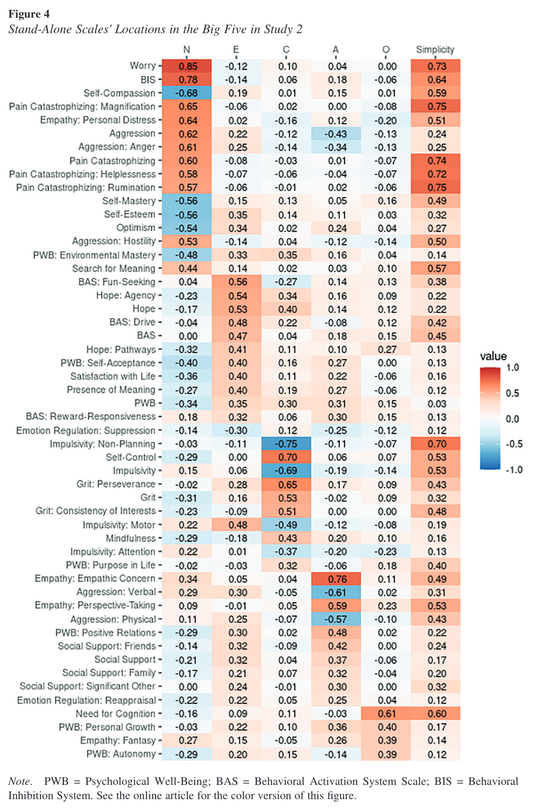

```{r, include=FALSE}
knitr::opts_chunk$set(message = FALSE,
                      warning = FALSE)
```

```{r}

# dependencies
library(tidyverse)
library(stringr)
library(knitr)
library(kableExtra)

```

# Single items attitude scales - AIID

```{r}

load("../data/aiid/processed/AIID_subset_confirmatory.RData")

data_trimmed <- AIID_subset_confirmatory %>%
  #filter(exclude_iat_stricter == FALSE) %>%
  filter(english_fluency %in% c("English fluent - speak/read it regularly", "English is my primary language")) |>
  dplyr::select(user_id, 
                domain, 
                age, 
                sex, 
                english_fluency, 
                exclude_iat_stricter, 
                block_order, 
                iat_type,
                D,
                # self-report attitudes data
                prefer, 
                others_prefer, 
                actual_x, actual_y, 
                actual_diff,
                gut_x, gut_y,
                # individual differences scales data
                individual_differences_measure, 
                individual_differences_sum_score)

```


```{r fig.height=8, fig.width=8}

dat_subset <- data_trimmed |>
  filter(domain %in% c("Poor People - Rich People",
                       "Conservatives - Liberals",
                       "Burger King - McDonald's",
                       "Protestants - Catholics"))

dat_r <- dat_subset |>
  group_by(domain) |>
  summarise(n = n(), 
            mean_prefer = mean(prefer, na.rm = TRUE),
            mean_actual_diff = mean(actual_diff, na.rm = TRUE),
            mean_actual_x = mean(actual_x, na.rm = TRUE),
            mean_actual_y = mean(actual_y, na.rm = TRUE),
            sd_prefer = sd(prefer, na.rm = TRUE),
            sd_actual_diff = sd(actual_diff, na.rm = TRUE),
            sd_actual_x = sd(actual_x, na.rm = TRUE),
            sd_actual_y = sd(actual_y, na.rm = TRUE),
            r_prefer_actual = broom::tidy(cor.test(actual_diff, prefer, use = "pairwise.complete.obs")),
            r_actuals = broom::tidy(cor.test(actual_x, actual_y, use = "pairwise.complete.obs"))) |>
            #r_gut = cor(gut_x, gut_y, use = "pairwise.complete.obs"),
            #r_selfother = cor(prefer, others_prefer, use = "pairwise.complete.obs")) |>
  unnest(r_prefer_actual, names_sep = "_") |>
  unnest(r_actuals, names_sep = "_") |>
  mutate_if(is.numeric, janitor::round_half_up, digits = 2) |>
  select(domain, n, 
         mean_prefer, mean_actual_diff, mean_actual_x, mean_actual_y, 
         sd_prefer, sd_actual_diff, sd_actual_x, sd_actual_y, 
         r_prefer_actual = r_prefer_actual_estimate, r_prefer_actual_lower = r_prefer_actual_conf.low, r_prefer_actual_upper = r_prefer_actual_conf.high, 
         r_actuals = r_actuals_estimate, r_actuals_lower = r_actuals_conf.low, r_actuals_upper = r_actuals_conf.high)

# dat_r |>
#   kable() |>
#   kable_classic(full_width = FALSE)

dat_r |>
  select(domain, n, 
         r_prefer_actual, r_actuals) |>
  kable() |>
  kable_classic(full_width = FALSE)

```

- "Actuals" are two separate ratings for how people 'actually' feel about two different concepts, e.g., "Rate your actual feelings toward the topics below: Actual feelings toward burger king [1-10] versus mcdonalds [1-10]". Depending on whether you thing the two concepts are opposition or not, they should be negative vs positively correlated. The fact that its a single item measure with lots of error probably reduces observed correlations, but single item scales are common.
  - Liking burger king ~ liking mcdonalds: r = .50 
  - Liking poor people ~ liking rich people: r = .06
  - Liking protestants ~ liking Catholics: r = .56
  - Liking conservatives ~ liking liberals: r = -.59

- "Prefer" is a single item relative preference between the two concepts, e.g., "I prefer burger king or mcdonalds [-3 to +3]. Correlating prefer vs the difference score between the two actual items emphasizes that these should be related concepts (both attitudes towards these domains) but merely changing the dimensionality of the questions (absolute vs relative evaluation) can change the results  
  - Difference in liking ~ preference for burger king vs liking mcdonalds: r = .69
  - Difference in liking ~ preference for poor people vs rich people: r = .79
  - Difference in liking ~ preference for protestants vs Catholics: r = .53
  - Difference in liking ~ preference for conservatives vs liberals: r = .64

## plot actual feelings towards x vs y items

```{r fig.height=8, fig.width=8}

mean_sd_points <- dat_subset %>%
  group_by(domain) %>%
  summarise(
    mean_x = mean(actual_x, na.rm = TRUE),
    mean_y = mean(actual_y, na.rm = TRUE),
    sd_x = sd(actual_x, na.rm = TRUE),
    sd_y = sd(actual_y, na.rm = TRUE)
  )

ggplot(dat_subset, aes(actual_x, actual_y)) +
  geom_jitter(alpha = 0.4) +
  # Red mean dot
  geom_point(
    data = mean_sd_points,
    aes(x = mean_x, y = mean_y),
    color = "red",
    size = 3,
    inherit.aes = FALSE
  ) +
  # Optional: add SD error bars (crosshairs)
  geom_errorbar(
    data = mean_sd_points,
    aes(x = mean_x, ymin = mean_y - sd_y, ymax = mean_y + sd_y),
    color = "red",
    width = 0,
    inherit.aes = FALSE
  ) +
  geom_errorbarh(
    data = mean_sd_points,
    aes(y = mean_y, xmin = mean_x - sd_x, xmax = mean_x + sd_x),
    color = "red",
    height = 0,
    inherit.aes = FALSE
  ) +
  facet_wrap(~ domain) +
  scale_x_continuous(breaks = scales::breaks_pretty(10)) +
  scale_y_continuous(breaks = scales::breaks_pretty(10)) +
  coord_fixed() +
  coord_cartesian(xlim = c(0.5, 10.5), ylim = c(0.5, 10.5))

```

## plot prefer vs actual items

```{r fig.height=8, fig.width=8}

mean_sd_points <- dat_subset %>%
  group_by(domain) %>%
  summarise(
    mean_y = mean(actual_diff, na.rm = TRUE),
    mean_x = mean(prefer, na.rm = TRUE),
    sd_y = sd(actual_diff, na.rm = TRUE),
    sd_x = sd(prefer, na.rm = TRUE)
  )

ggplot(dat_subset, aes(actual_diff, prefer)) +
  geom_jitter(alpha = 0.4) +
  # Red mean dot
  geom_point(
    data = mean_sd_points,
    aes(x = mean_x, y = mean_y),
    color = "red",
    size = 3,
    inherit.aes = FALSE
  ) +
  # Optional: add SD error bars (crosshairs)
  geom_errorbar(
    data = mean_sd_points,
    aes(x = mean_x, ymin = mean_y - sd_y, ymax = mean_y + sd_y),
    color = "red",
    width = 0,
    inherit.aes = FALSE
  ) +
  geom_errorbarh(
    data = mean_sd_points,
    aes(y = mean_y, xmin = mean_x - sd_x, xmax = mean_x + sd_x),
    color = "red",
    height = 0,
    inherit.aes = FALSE
  ) +
  facet_wrap(~ domain) +
  scale_x_continuous(breaks = scales::breaks_pretty(10)) +
  scale_y_continuous(breaks = scales::breaks_pretty(7)) +
  coord_fixed() +
  coord_cartesian(xlim = c(-10.5, 10.5), ylim = c(-3.5, +3.5))

```

# Single items from indiviudal differences scales - AIID

Largest correlations

```{r}

dat_subset <- AIID_subset_confirmatory |>
  filter(english_fluency %in% c("English fluent - speak/read it regularly", "English is my primary language")) |>
  filter(complete_individual_differences_data == TRUE) |>
  select(bfi_o1, bfi_o5, bfi_e1, bfi_e5, bfi_n1, bfi_n4) |>
  select(starts_with("bfi", ignore.case = FALSE))

dat_subset |>
  summarize(n_first_half = sum(!is.na(bfi_e1)),
            n_second_half = sum(!is.na(bfi_o1))) |>
  kable() |>
  kable_classic(full_width = FALSE)

mat <- dat_subset |>
  cor(use = "pairwise.complete.obs") |>
  janitor::round_half_up(2)

mat |>
  kable() |>
  kable_classic(full_width = FALSE)

```

- bfi_o1 "I see myself as a person who… Is original, comes up with new ideas" ~ bfi_o5 "I see myself as a person who… Is inventive" r = .62
- bfi_e1 "I see myself as a person who… Is talkative" ~ bfie5 "I see myself as a person who… Tends to be quiet" r = -.61
- bfi_n1 "I see myself as a person who… Gets nervous easily" ~ bfi_n4 "I see myself as a person who… Worries a lot" r = .40

# Indiviudal differences scales - Bainbridge 



- N = 388
- Worry ~ neuroticism, r = .85
- Verbal aggression ~ agreeableness, r = -.61
- Openness ~ need for cognition, r = .60

# Correlation between weight and height in humans

in US adults, 2008-2012. NHANES CDC data.

```{r}

library(NHANES)
data(NHANES)

dat <- NHANES |>
  filter(Age >= 18) |>
  filter(!is.na(Height) & !is.na(Weight)) 

ggplot(dat, aes(Weight, Height)) +
  geom_point(alpha = 0.1)

ggplot(dat, aes(Weight, Height)) +
  geom_point(alpha = 0.1) +
  facet_wrap(~ Gender)

dat |>
  summarize(n = n(),
            cor = broom::tidy(cor.test(Weight, Height, use = "pairwise.complete.obs"))) |>
  unnest(cor) |>
  select(n, r = estimate, ci_lower = conf.low, ci_upper = conf.high) |>
  mutate_if(is.numeric, janitor::round_half_up, digits = 2) |>
  kable() |>
  kable_classic(full_width = FALSE)

dat |>
  group_by(Gender) |>
  summarize(n = n(),
            cor = broom::tidy(cor.test(Weight, Height, use = "pairwise.complete.obs"))) |>
  unnest(cor) |>
  select(n, r = estimate, ci_lower = conf.low, ci_upper = conf.high) |>
  mutate_if(is.numeric, janitor::round_half_up, digits = 2) |>
  kable() |>
  kable_classic(full_width = FALSE)

```

## Difference between average height of adult men vs women 

```{r}

dat <- NHANES |>
  filter(Age >= 18) |>
  filter(!is.na(Gender) & !is.na(Height) & !is.na(Weight)) 

dat |>
  summarize(n = n()) |>
  kable() |>
  kable_classic(full_width = FALSE)


```

Weight:

```{r}
  
effsize::cohen.d(Weight ~ Gender, data = dat)

```

Height:

```{r}
effsize::cohen.d(Height ~ Gender, data = dat)

```


