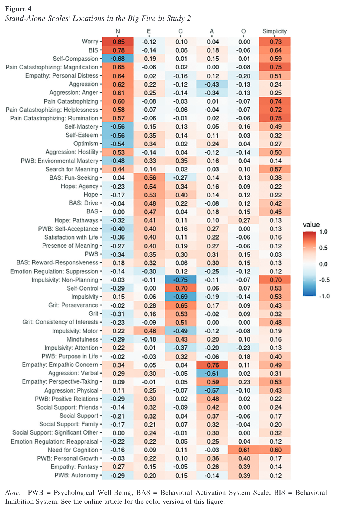

```{r, include=FALSE}
knitr::opts_chunk$set(message = FALSE,
                      warning = FALSE)
```

```{r}

# dependencies
library(tidyverse)
library(scales)
library(stringr)
library(effectsize)
library(janitor)
library(knitr)
library(kableExtra)

```

# Indiviudal differences scales - Bainbridge 



- N = 388
- Worry ~ neuroticism, r = .85
- Verbal aggression ~ agreeableness, r = -.61
- Openness ~ need for cognition, r = .60

# Correlation between weight and height in humans

in US adults, 2008-2012. NHANES CDC data.

```{r}

library(NHANES)
data(NHANES)

dat <- NHANES |>
  filter(Age >= 18) |>
  filter(!is.na(Height) & !is.na(Weight)) 

ggplot(dat, aes(Weight, Height)) +
  geom_point(alpha = 0.1)

ggplot(dat, aes(Weight, Height)) +
  geom_point(alpha = 0.1) +
  facet_wrap(~ Gender)

dat |>
  summarize(n = n(),
            cor = broom::tidy(cor.test(Weight, Height, use = "pairwise.complete.obs"))) |>
  unnest(cor) |>
  select(n, r = estimate, ci_lower = conf.low, ci_upper = conf.high) |>
  mutate_if(is.numeric, janitor::round_half_up, digits = 2) |>
  kable() |>
  kable_classic(full_width = FALSE)

dat |>
  group_by(Gender) |>
  summarize(n = n(),
            cor = broom::tidy(cor.test(Weight, Height, use = "pairwise.complete.obs"))) |>
  unnest(cor) |>
  select(n, r = estimate, ci_lower = conf.low, ci_upper = conf.high) |>
  mutate_if(is.numeric, janitor::round_half_up, digits = 2) |>
  kable() |>
  kable_classic(full_width = FALSE)

```

## Difference between average height of adult men vs women 

```{r}

dat <- NHANES |>
  filter(Age >= 18) |>
  filter(!is.na(Gender) & !is.na(Height) & !is.na(Weight)) 

dat |>
  summarize(n = n()) |>
  kable() |>
  kable_classic(full_width = FALSE)


```

Weight:

```{r}
  
effsize::cohen.d(Weight ~ Gender, data = dat)

```

Height:

```{r}
effsize::cohen.d(Height ~ Gender, data = dat)

```
